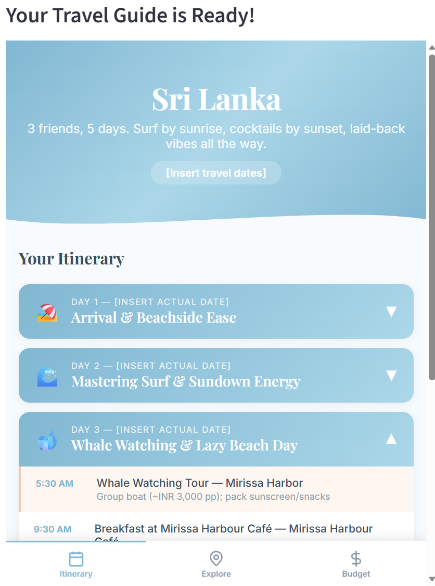
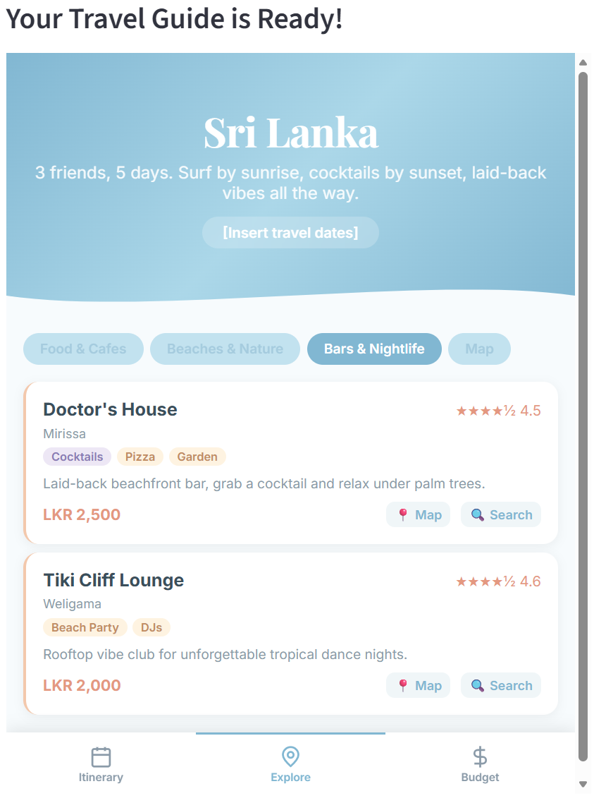

# Multi-Agent Systems

A portfolio of multi-agent AI systems, each exploring a different orchestration pattern. Collaborative agents that help each other. Adversarial agents that argue with each other. Constructive agents that build something together.

| Project | What It Does | Pattern | Agents |
|---------|-------------|---------|--------|
| [Product Strategy Forge](product-strategy-forge/) | Turns a problem statement into a Product Strategy Blueprint | Collaborative + cross-model critique | 9 |
| [Debate Arena](debate-arena/) | Turns a decision question into a scored Decision Brief | Adversarial, multi-round debate | 6 |
| [Voyage Agents](voyage-agents/) | Turns a trip idea into an interactive travel guide website | Research → plan → review → build | 7 |
| [Product Strategy Solo](product-strategy-solo/) | Baseline comparison for the Forge (no critique) | Collaborative, single-pass | 8 |

## Projects

### [Product Strategy Forge](product-strategy-forge/)

9 agents collaborate to turn a problem statement into a Product Strategy Blueprint. Three researchers run in parallel, a Synthesizer cross-references their findings, and a Critic powered by a separate LLM challenges the work - sending agents back to redo weak sections. You approve between phases.


---

### [Debate Arena](debate-arena/)

6 agents engage in structured adversarial debate across 3 rounds. Advocate Alpha and Beta argue opposing positions, a Devil's Advocate attacks both, agents cross-examine each other's claims, then defend under fire. A Judge scores arguments on 5 criteria, and a Synthesizer compiles a Decision Brief.

---

### [Voyage Agents](voyage-agents/)

7 agents research, plan, review, and build a complete interactive travel guide website. Destination research, venue curation with coordinates, logistics planning - all in parallel. A reviewer on a different LLM quality-checks. An itinerary architect and budget analyst build the plan. A website builder assembles everything into a shareable HTML file with maps and venue cards.

<p>


</p>

---

### [Product Strategy Solo](product-strategy-solo/)

Same pipeline as the Forge, minus the Critic. Single-pass baseline - no redo loops, no cross-model challenge. Exists for direct comparison to see what critique catches.

## Quick Start

Each project is independent:

```bash
cd <project-name>
pip install -r requirements.txt
streamlit run app.py          # Interactive UI with human-in-the-loop
```

Or terminal mode:

```bash
python forge.py "your prompt"    # Product Strategy Forge
python arena.py "your prompt"    # Debate Arena
python voyage.py "your prompt"   # Voyage Agents
python solo.py "your prompt"     # Product Strategy Solo
```

## Setup

Create a `.env` in each project directory:

```env
AZURE_OPENAI_API_KEY=your-key
AZURE_OPENAI_ENDPOINT=https://your-resource.openai.azure.com/
AZURE_OPENAI_DEPLOYMENT=gpt-4o
AZURE_OPENAI_API_VERSION=2024-12-01-preview
GEMINI_API_KEY=your-gemini-key  # Needed for Forge and Voyage
```
