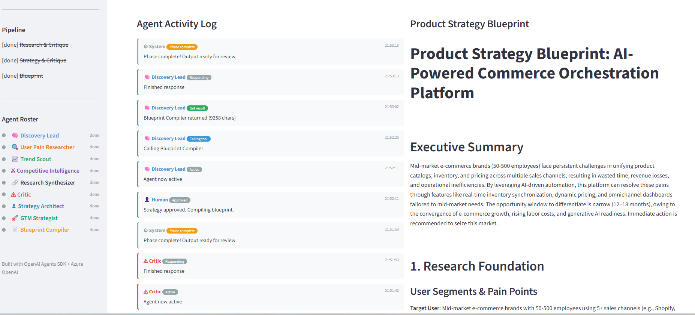
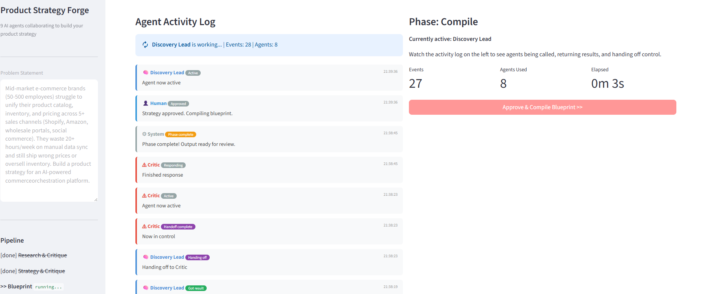

# Product Strategy Forge

A multi-agent system where 9 specialized AI agents collaborate to turn a problem statement into a comprehensive Product Strategy Blueprint, with human-in-the-loop approval at every phase.

## What This Is

Product Strategy Forge is an AI-powered strategy engine that replicates how a high-performing product team works. Instead of one LLM answering in a single pass, nine agents with distinct roles research, debate, critique, and refine, producing output that's stronger than any single prompt could generate.

**The problem it solves:** Crafting a product strategy requires pulling together user research, market trends, competitive analysis, strategic framing, and go-to-market planning. Doing this well takes a team of specialists and weeks of work. Product Strategy Forge compresses that into minutes by orchestrating a team of AI agents that challenge each other's thinking.

**What makes it different from a single ChatGPT prompt:**

- **Specialization**: Each agent has a focused role and tailored instructions. A Trend Scout thinks differently than a Competitive Intelligence analyst.
- **Critique loops**: A dedicated Critic agent evaluates the work and sends specific agents back to redo weak sections. This back-and-forth catches gaps that a single pass misses.
- **Parallel research**: Three research agents run simultaneously, then a Synthesizer cross-references their findings to surface contradictions and reinforcing patterns.
- **Human-in-the-loop**: You review and approve (with optional guidance) between each phase. The agents work for you, not instead of you.
- **Structured output**: The final Blueprint Compiler produces a polished, presentation-ready strategy document with executive summary, research foundation, strategic direction, GTM plan, and risk analysis.

**Who it's for:** Product managers, founders, strategists, and anyone who needs to go from "I have a problem space" to "I have a strategy document" fast, without sacrificing rigor.

## How It Works

```
                        ┌──────────────────┐
                        │  Discovery Lead   │  Orchestrator: dispatches agents,
                        │                  │  coordinates phases, responds to critique
                        └────────┬─────────┘
                                 │
          ┌──────────────────────┼──────────────────────┐
          ▼                      ▼                      ▼
 ┌────────────────┐   ┌────────────────┐   ┌────────────────────┐
 │  User Pain     │   │  Trend Scout   │   │   Competitive      │
 │  Researcher    │   │                │   │   Intelligence     │
 └───────┬────────┘   └───────┬────────┘   └─────────┬──────────┘
         └────────────────────┼──────────────────────┘
                              ▼
                  ┌────────────────────────┐
                  │  Research Synthesizer   │  Cross-references findings,
                  │                        │  surfaces contradictions
                  └───────────┬────────────┘
                              ▼
                  ┌────────────────────────┐
                  │        Critic          │◄─── Can send agents back
                  │                        │     with specific feedback
                  └───────────┬────────────┘
                              ▼
          ┌───────────────────┴───────────────────┐
          ▼                                       ▼
 ┌────────────────────┐             ┌────────────────────┐
 │ Strategy Architect  │            │  GTM Strategist     │
 └─────────┬──────────┘             └─────────┬──────────┘
           └──────────────┬───────────────────┘
                          ▼
              ┌────────────────────────┐
              │   Blueprint Compiler   │  Assembles the final
              │                        │  strategy document
              └────────────────────────┘
```

### The Critique Loop

The Critic agent evaluates research quality and can send specific agents back for revisions. This is what makes the system more than a pipeline.

1. Research agents produce their findings
2. Synthesizer combines everything
3. Critic evaluates: Are there gaps? Missing segments? Weak claims?
4. If gaps exist, the Critic hands off back to the Discovery Lead with specific instructions like *"The Researcher needs to investigate enterprise buyers"*
5. Discovery Lead re-dispatches only the flagged agents with the critique feedback
6. The revised work goes back through the Critic
7. Once approved, the system moves to strategy

This back-and-forth produces stronger output than a single pass.

### The 3 Phases (with Human Approval)

| Phase | What Happens | You Decide |
|-------|-------------|------------|
| **1. Research & Critique** | 3 researchers run in parallel, synthesizer cross-references, critic evaluates (up to 2 redo rounds) | Review research, add guidance for strategy |
| **2. Strategy & Critique** | Strategy Architect builds vision + bets, GTM Strategist plans go-to-market, critic evaluates (up to 1 redo round) | Review strategy, add guidance for blueprint |
| **3. Blueprint** | Blueprint Compiler assembles everything into a polished strategy document | Download the final `.md` file |

### Screenshots





## The 9 Agents

| # | Agent | What It Does |
|---|-------|-------------|
| 1 | **Discovery Lead** | Orchestrator. Decides which agents to call, when to request critique, how to respond to feedback |
| 2 | User Pain Researcher | Identifies user segments, pain points, and jobs-to-be-done |
| 3 | Trend Scout | Analyzes industry trends, timing windows, and answers "why now?" |
| 4 | Competitive Intelligence | Maps competitors, assesses moats, identifies market gaps |
| 5 | Research Synthesizer | Cross-references all research, surfaces contradictions, ranks insights |
| 6 | **Critic** | Evaluates work quality. Approves or sends specific agents back with targeted feedback |
| 7 | Strategy Architect | Builds product vision, strategic bets, moat strategy, sequencing |
| 8 | GTM Strategist | Builds go-to-market: beachhead segment, positioning, channels, pricing, launch phases |
| 9 | Blueprint Compiler | Compiles all work into a polished Product Strategy Blueprint |

## SDK Patterns Used

| Pattern | Where |
|---------|-------|
| **Agent-as-Tool** | Discovery Lead calls 7 specialist agents as tools |
| **Bidirectional Handoff** | Discovery Lead and Critic transfer control back and forth |
| **Parallel Tool Calls** | Discovery Lead dispatches 3 research agents at once |
| **RunHooks** | Streamlit UI uses hooks to stream agent activity to the sidebar in real-time |

## Output

The final deliverable is a Product Strategy Blueprint with:
- Executive Summary
- Research Foundation (user segments, pain points, trends, competitive landscape)
- Synthesis and Key Insights
- Strategic Direction (vision, bets, moat, sequencing)
- Go-to-Market (beachhead, positioning, channels, pricing, launch phases)
- Risks and Open Questions
- Agent Deliberation Log (what the Critic pushed back on and what changed)

## Setup

```bash
git clone <repo-url>
cd Multi-agent-systems/product-strategy-forge

python -m venv venv
source venv/bin/activate        # macOS/Linux
venv\Scripts\activate           # Windows

pip install -r requirements.txt

cp .env.example .env
# Add your Azure OpenAI credentials to .env
```

### Environment Variables

| Variable | Description |
|----------|-------------|
| `AZURE_OPENAI_API_KEY` | Your Azure OpenAI API key |
| `AZURE_OPENAI_ENDPOINT` | Your Azure OpenAI endpoint URL |
| `AZURE_OPENAI_DEPLOYMENT` | Deployment name (default: `gpt-4o`) |
| `AZURE_OPENAI_API_VERSION` | API version (default: `2024-12-01-preview`) |
| `MAX_TURNS` | Maximum agent turns per phase (default: `40`) |

## Run

Streamlit UI (human-in-the-loop at each phase):
```bash
streamlit run app.py
```

Terminal mode (fully autonomous, no approval gates):
```bash
python forge.py "Your problem statement here"
```

### Sample Prompts

Try these as problem statements:

> Mid-market e-commerce brands (50-500 employees) struggle to unify their product catalog, inventory, and pricing across 5+ sales channels. They waste 20+ hours/week on manual data sync and still ship wrong prices or oversell inventory. Build a product strategy for an AI-powered commerce orchestration platform.

> Engineering teams at Series B-D startups spend 30% of their sprint capacity on incident response, yet still have 4+ hour MTTR. Existing observability tools generate alert fatigue without actionable root-cause analysis. Build a product strategy for an AI copilot that auto-triages incidents and suggests fixes.

> Remote teams of 10-50 people have no good way to run async standups and stay aligned on weekly goals without drowning in Slack messages and status meetings. Build a product strategy for a lightweight async collaboration tool.

## Project Structure

```
product-strategy-forge/
├── forge_agents/
│   ├── lead.py              # Discovery Lead (7 tools + Critic handoff)
│   ├── researcher.py        # User Pain Researcher
│   ├── trend_scout.py       # Trend Scout
│   ├── competitive.py       # Competitive Intelligence
│   ├── synthesizer.py       # Research Synthesizer
│   ├── critic.py            # Critic (bidirectional handoff with Discovery Lead)
│   ├── strategist.py        # Strategy Architect
│   ├── gtm.py               # GTM Strategist
│   └── compiler.py          # Blueprint Compiler
├── app.py                   # Streamlit UI (human-in-the-loop)
├── forge.py                 # Terminal runner (autonomous)
├── config.py                # Azure OpenAI configuration
├── requirements.txt
└── .env.example
```

## Tech Stack

- [OpenAI Agents SDK](https://openai.github.io/openai-agents-python/) for agent orchestration
- Azure OpenAI (GPT-4o) powering all 9 agents
- Streamlit for the human-in-the-loop UI with real-time agent activity tracking
- Python 3.11+
