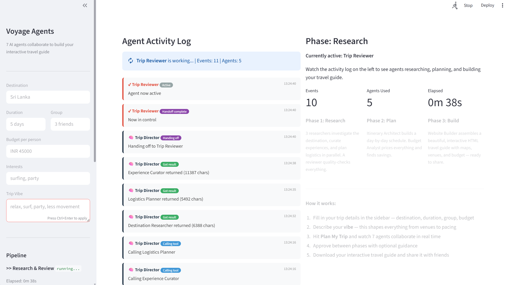

# Voyage Agents

A multi-agent system where 7 AI agents collaborate to turn a trip idea into a complete, interactive travel guide website  - with maps, venue cards, day-by-day itinerary, and budget breakdowns. All in a single shareable HTML file.

## What This Is

Imagine typing "Bali, 5 days, 4 friends, $600 each, surf and chill vibes"  - and getting back a full website with your day-by-day itinerary, every cafe and beach club pinned on an interactive map, costs broken down per person, and a budget dashboard telling you where to splurge vs save. That's Voyage Agents.

Seven specialized AI agents research, curate, plan, review, and build  - each with a distinct role. A Destination Researcher thinks differently than an Experience Curator or a Budget Analyst. A Trip Reviewer powered by a different LLM (Gemini) catches blind spots the other agents miss. You approve between phases and can steer the plan with guidance. The output is a beautiful, mobile-first HTML file you open in your browser and share with your travel group.

### Screenshots



<p>


</p>

## How It Works

```
                     ┌────────────────┐
                     │  Trip Director  │  Orchestrator
                     └───────┬────────┘
                             │
       ┌─────────────────────┼─────────────────────┐
       ▼                     ▼                     ▼
┌──────────────┐   ┌────────────────┐   ┌──────────────────┐
│ Destination  │   │  Experience    │   │    Logistics     │
│ Researcher   │   │  Curator      │   │    Planner       │
└──────┬───────┘   └───────┬────────┘   └────────┬─────────┘
       └───────────────────┼─────────────────────┘
                           ▼
               ┌────────────────────────┐
               │   Trip Reviewer        │◄─── Can send agents back
               │   (Gemini)            │     with specific feedback
               └───────────┬────────────┘
                           ▼
       ┌───────────────────┴───────────────────┐
       ▼                                       ▼
┌──────────────────┐              ┌──────────────────┐
│    Itinerary     │              │     Budget       │
│    Architect     │              │     Analyst      │
└────────┬─────────┘              └────────┬─────────┘
         └──────────────┬──────────────────┘
                        ▼
            ┌────────────────────────┐
            │    Website Builder     │  → Interactive HTML
            └────────────────────────┘
```

### The 3 Phases (with Human Approval)

| Phase | What Happens | You Decide |
|-------|-------------|------------|
| **1. Research & Review** | 3 researchers run in parallel, Gemini reviewer evaluates with up to 1 redo round | Review research, add guidance |
| **2. Itinerary & Budget** | Day-by-day schedule using real venues, per-person cost breakdown with splurge/save tips | Review the plan, adjust |
| **3. Build Website** | All data assembled into an interactive HTML travel guide | Preview in-app, download `.html` |

## The 7 Agents

| # | Agent | Role | Model |
|---|-------|------|-------|
| 1 | **Trip Director** | Orchestrator  - dispatches agents, responds to review feedback | GPT-4o |
| 2 | Destination Researcher | Culture, weather, visa, safety, neighborhoods, local tips | GPT-4o |
| 3 | Experience Curator | Restaurants, cafes, bars, beaches, activities  - with coordinates, costs, ratings | GPT-4o |
| 4 | Logistics Planner | Flights, transport, accommodation zones, money tips | GPT-4o |
| 5 | **Trip Reviewer** | Quality check  - catches unrealistic timing, missing meals, vibe mismatches | Gemini |
| 6 | Itinerary Architect | Day-by-day plan with geographic clustering, energy management, meal planning | GPT-4o |
| 7 | Budget Analyst | Per-person breakdown, splurge vs save, hidden costs | GPT-4o |
| 8 | Website Builder | Converts structured data into JSON that powers the HTML template | GPT-4o |

## The Output

A self-contained HTML file you open in any browser:

- **Collapsible day cards** with time-slotted itinerary
- **Venue cards** with ratings, costs, tags, Google Maps + Search links
- **Leaflet.js interactive map** with color-coded markers
- **Budget dashboard** with category breakdown and money tips
- **Mobile-first design** with bottom tab navigation  - share with your group

## Setup

```bash
cd voyage-agents
pip install -r requirements.txt
```

Create a `.env` file:

| Variable | Description |
|----------|-------------|
| `AZURE_OPENAI_API_KEY` | Your Azure OpenAI API key |
| `AZURE_OPENAI_ENDPOINT` | Your Azure OpenAI endpoint URL |
| `AZURE_OPENAI_DEPLOYMENT` | Deployment name (default: `gpt-4o`) |
| `AZURE_OPENAI_API_VERSION` | API version (default: `2024-12-01-preview`) |
| `GEMINI_API_KEY` | Google Gemini API key (powers the Trip Reviewer) |

## Run

```bash
streamlit run app.py                    # Interactive UI with approval gates
python voyage.py "your trip details"    # Autonomous terminal mode
```

### Sample Inputs

> **Destination:** Bali | **Duration:** 5 days | **Group:** 4 friends | **Budget:** $600/person
> **Vibe:** Surf mornings in Canggu, explore Ubud, party in Seminyak. Great food and hidden cafes.

> **Destination:** Sri Lanka | **Duration:** 5 days | **Group:** 6 friends | **Budget:** $800/person
> **Vibe:** Chill beach mornings with surfing, sunset cocktails at beach clubs, a couple of wild nights out. Weligama and Mirissa.

## Project Structure

```
voyage-agents/
├── voyage_agents/
│   ├── director.py          # Trip Director (6 tools + Reviewer handoff)
│   ├── researcher.py        # Destination Researcher
│   ├── curator.py           # Experience Curator
│   ├── logistics.py         # Logistics Planner
│   ├── itinerary.py         # Itinerary Architect
│   ├── budget.py            # Budget Analyst
│   ├── reviewer.py          # Trip Reviewer (Gemini)
│   ├── builder.py           # Website Builder (JSON output)
│   └── template.py          # HTML template with Leaflet maps
├── app.py                   # Streamlit UI
├── voyage.py                # Terminal runner
├── config.py                # Azure OpenAI + Gemini config
└── requirements.txt
```

## SDK Patterns Used

| Pattern | Where |
|---------|-------|
| **Agent-as-Tool** | Director calls 6 specialists as tools |
| **Cross-Model Review** | Reviewer runs on Gemini  - different LLM, different blind spots |
| **Bidirectional Handoff** | Director ↔ Reviewer transfer control back and forth |
| **Parallel Execution** | 3 research agents run simultaneously |
| **Data-Driven Template** | Builder outputs JSON, template renders the interactive website |

## Tech Stack

- [OpenAI Agents SDK](https://openai.github.io/openai-agents-python/) for orchestration
- Azure OpenAI (GPT-4o) + Google Gemini for cross-model review
- Streamlit for the human-in-the-loop UI
- Leaflet.js for interactive maps
- Python 3.11+
